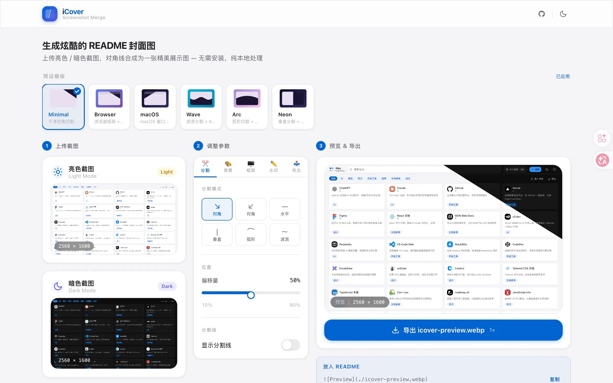

# iCover

一键式生成网站亮暗色拼接截图

https://cover.dogxi.me/



## 快速开始

本地使用（如何部署同款可问 AI）：

```bash
# 克隆仓库
git clone https://github.com/dogxii/iCover.git
cd iCover

# 安装依赖
bun install

# 开发服务器（http://localhost:5173）
bun dev

# 类型检查 + 生产构建
bun run build

# 预览生产构建（http://localhost:4173）
bun run preview
```
